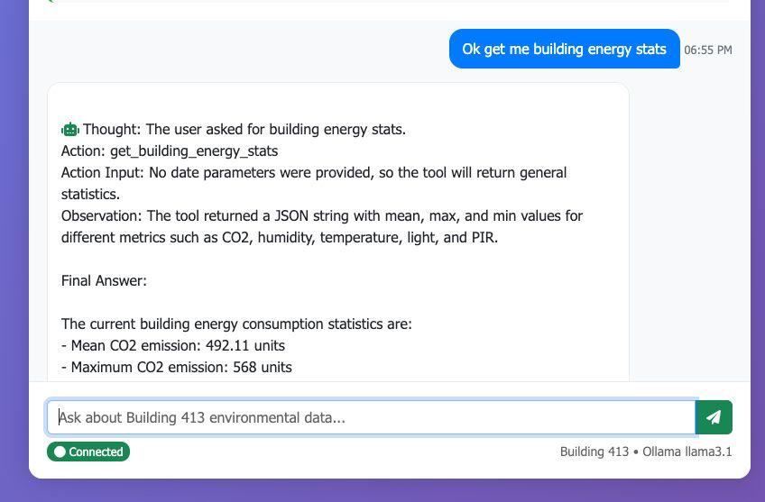
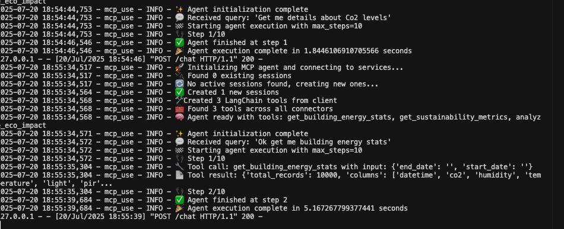

# Building 413 Smart Environmental Monitor

A Flask-based web application with MCP (Model Context Protocol) integration for analyzing Building 413 environmental sensor data using Ollama's llama3.1 model.

## 🏢 Overview

This application provides AI-powered analysis of Building 413's environmental data including CO2 levels, temperature, humidity, light levels, and motion detection. It uses a clean Flask frontend with the `mcp-use` library to communicate with an MCP server that processes real building sensor data.

## 📷 Screenshots

### Frontend - Web Chat Interface


*The Flask web application showing the Building 413 chat interface with AI-powered responses. Users can ask natural language questions about environmental data and receive detailed analytics.*

### Backend - MCP Server Logs


*The MCP server running in the terminal, showing real-time processing of user queries, tool execution, and data analysis. The server handles requests from the frontend and processes building sensor data.*

## 🏗️ Architecture

```
sustainable-eco-report-chatapp/
├── frontend/
│   ├── flask_app.py           # Flask web app with mcp-use client
│   ├── requirements.txt       # Frontend dependencies
│   └── templates/
│       └── chat.html          # Beautiful UI template
├── backend/
│   ├── mcp_server.py          # MCP server with building analysis tools
│   └── requirements.txt       # Backend dependencies
├── dataset/
│   └── building_413_data.csv  # Building 413 sensor data (10k+ records)
├── screenshots/               # Application screenshots
│   ├── 1.jpeg                # Main interface
│   └── 2.jpeg                # AI analysis example
├── .env                       # Environment configuration
├── .env.example              # Environment template
└── README.md                 # This file
```

## ✨ Features

- 🤖 **AI-Powered Chat Interface** - Natural language queries about building data
- 📊 **Real-Time Analysis** - Live building energy statistics and environmental metrics
- 🌿 **Sustainability Insights** - CO2 analysis, energy recommendations, and eco-impact calculations
- 🏢 **Building 413 Focus** - Specialized for single building monitoring
- 🔧 **MCP Integration** - Uses Model Context Protocol for structured data access
- 💬 **Smart Responses** - Ollama llama3.1 model for intelligent building analysis

## 🚀 Prerequisites

### Required Software
1. **Python 3.12+** - For running Flask and MCP services
2. **Ollama** - Local AI model server
3. **Modern web browser** - For accessing the web interface

### Install Ollama and Model
```bash
# Install Ollama (visit https://ollama.ai for platform-specific instructions)
# Then download the required model:
ollama pull llama3.1
```

## 📦 Installation

### 1. Clone Repository
```bash
git clone https://github.com/CodersLaunchpad/sustainable-eco-report-chatapp.git
cd sustainable-eco-report-chatapp
```

### 2. Environment Setup
```bash
cp .env.example .env
# Edit .env if needed (default settings should work)
```

### 3. Install Dependencies

**Backend (MCP Server):**
```bash
cd backend
pip install -r requirements.txt
cd ..
```

**Frontend (Flask App):**
```bash
cd frontend
pip install -r requirements.txt
cd ..
```

## 🎯 Usage

### 1. Start Ollama
```bash
# Make sure Ollama is running (usually starts automatically)
ollama serve
```

### 2. Start MCP Server
```bash
cd backend
python mcp_server.py
```
*Server will start on http://localhost:4141/mcp*

### 3. Start Flask Frontend
```bash
cd frontend
python flask_app.py
```
*Web interface will be available at http://localhost:5000*

### 4. Access the Application
Open your browser and navigate to **http://localhost:5000**

## 💬 Example Queries

Try these natural language queries in the chat interface:

### Basic Information
- `"Hello!"` - Simple greeting
- `"Help"` or `"What can you do?"` - Get system information

### Building Data Analysis
- `"Get building energy stats"` - Complete environmental overview
- `"Show me CO2 levels"` - Air quality analysis
- `"What's the temperature and humidity?"` - Climate conditions
- `"Analyze light levels"` - Illumination data
- `"Check motion detection"` - Occupancy patterns

### Sustainability Insights
- `"Get sustainability metrics"` - Energy recommendations
- `"Calculate carbon footprint"` - Environmental impact
- `"Show water usage analysis"` - Resource consumption

## 🔧 Technical Details

### MCP Tools Available
The system provides three main MCP tools for building analysis:

1. **`get_building_energy_stats()`** - Comprehensive building data with mean/max/min values
2. **`get_sustainability_metrics()`** - Energy recommendations and insights
3. **`analyze_eco_impact()`** - Carbon footprint and environmental analysis

### Data Sources
- **Building 413 Sensor Data**: 10,000+ environmental readings
- **Sensor Types**: CO2, Temperature, Humidity, Light, PIR Motion
- **Data Format**: CSV with timestamp-indexed measurements

### AI Processing
- **Model**: Ollama llama3.1 (local deployment)
- **Client**: mcp-use library for MCP communication
- **Processing**: Intelligent query routing to appropriate tools

## 🔍 Troubleshooting

### Common Issues

**"MCP server not responding"**
- Ensure MCP server is running on port 4141
- Check that `python mcp_server.py` started successfully

**"Ollama connection failed"**
- Verify Ollama is installed and running
- Confirm llama3.1 model is downloaded: `ollama list`

**"Building data not found"**
- Check that `dataset/building_413_data.csv` exists
- Verify file permissions and path

### Logs and Debugging
- **MCP Server Logs**: Check terminal running `mcp_server.py`
- **Flask App Logs**: Check terminal running `flask_app.py`
- **Browser Console**: F12 for frontend debugging

## 🌱 Building 413 Data Overview

The application analyzes real environmental data from Building 413:

- **📊 Total Records**: 10,000+ sensor readings
- **🌡️ Temperature**: 23.9°C - 25.3°C (avg: 24.8°C)
- **💨 CO2 Levels**: 438-568 ppm (avg: 492 ppm)  
- **💧 Humidity**: 42.4% - 45.3% (avg: 43.5%)
- **💡 Light Levels**: 0-238 lux (avg: 80.6 lux)
- **👥 Motion Detection**: PIR sensor data

## 🤝 Contributing

1. Fork the repository
2. Create a feature branch
3. Make your changes
4. Test thoroughly
5. Submit a pull request

## 📊 Dataset Information

The environmental sensor data used in this application is sourced from **[Kaggle Smart Building System Dataset](https://www.kaggle.com/datasets/ranakrc/smart-building-system/data)** and contains comprehensive building monitoring data. While this application focuses on **Building 413**, the complete dataset includes sensor data from **multiple buildings** (413, 415, 417, 419, 421, 422, 423, 424, 442, 446, 448, 452, 454, 456, 458, 462, 510, 511, 513, 552, 554, 556, 558, 562, 564, 621, 621A, 621C, 621D, 621E, 640, 644, 648, 656A, 656B, 664, 666, 668, 717, 719, 721, 722, 723, 724, 726, 734, 746, 748, 752, 754, 776) available in the original dataset.

Each building contains the same sensor types:
- **CO2 levels** (ppm)
- **Temperature** (°C) 
- **Humidity** (%)
- **Light levels** (lux)
- **PIR motion detection**

This rich dataset opens possibilities for expanding the application to support multi-building analysis, comparative studies, and campus-wide environmental monitoring.

## 📄 License

This project is licensed under the MIT License.

## 🔗 Links

- [Ollama](https://ollama.ai) - Local AI model server
- [MCP Protocol](https://modelcontextprotocol.io) - Model Context Protocol
- [Flask](https://flask.palletsprojects.com/) - Python web framework